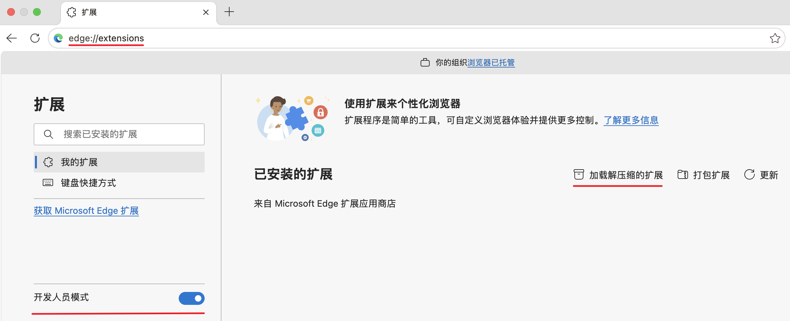
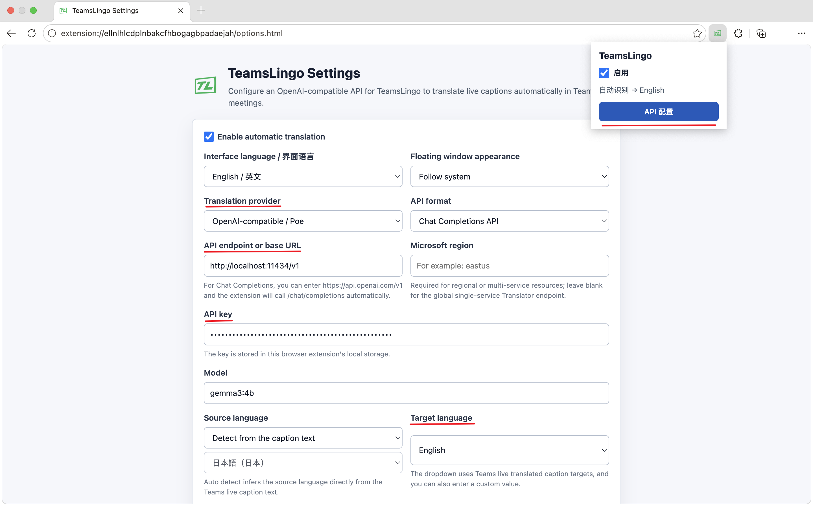
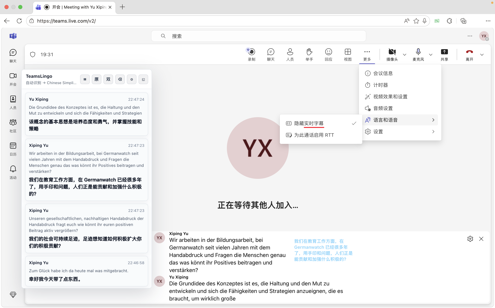

# TeamsLingo

**[中文](README.md)** | English | [日本語](README.ja.md)


A browser extension for real-time translation of Microsoft Teams live captions on Teams Web, installable in Microsoft Edge and Google Chrome (Windows, macOS, Linux). TeamsLingo monitors the caption feed in Teams Web meetings, sends each sentence to your configured translation service, supports free direct Google Translate and Microsoft Translator paths plus OpenAI and compatible APIs, including Poe and local LLM services, and displays the translated text alongside the original captions as well as in a floating side window. Meeting captions and translations can also be exported.


---

## Install from Source

1. Open the extensions page in your browser:
   - Edge: `edge://extensions/`
   - Chrome: `chrome://extensions/`
2. Enable **Developer mode** using the toggle on the page.
3. Click **Load unpacked** and select this project directory.



> The screenshot is from Edge; the flow is the same in Chrome.

4. After installation, click the TeamsLingo toolbar icon and open the **Settings** page.
5. Fill in your translation settings, including API format, endpoint, API key, model, source language mode, and target language. For Google Translate / Microsoft Translator, you can leave the API key blank to use free mode.



> **Availability:** The current package can be loaded through Developer mode in both Edge and Chrome. Store listings are not published yet.

## Usage

1. Open a Teams Web meeting in Edge or Chrome.
2. Turn on **Live Captions** in Teams.
3. TeamsLingo will automatically show a floating translation panel on the right side of the page. Once a caption sentence settles, the translation appears both inline and in the side panel.
4. You can export either the source captions or a bilingual transcript from the panel when needed.



---

## Translation Service Configuration

TeamsLingo supports three types of translation services.

### OpenAI-compatible APIs, Poe, and local LLM services

TeamsLingo supports two OpenAI-compatible request formats.

**Chat Completions API:**

```http
POST https://api.openai.com/v1/chat/completions
Authorization: Bearer <API Key>
Content-Type: application/json
```

The request body includes `model`, `temperature`, and `messages`.

**Responses API:**

```http
POST https://api.poe.com/v1/responses
Authorization: Bearer <API Key>
Content-Type: application/json
```

The request body includes `model`, `temperature`, and `input`. If the endpoint is `https://api.poe.com/v1`, the extension automatically appends `/responses` or `/chat/completions` based on the selected API format.

**Poe example configuration:**

```text
Translation Service: OpenAI-compatible API / Poe
API Format: Responses API
API Endpoint / Base URL: https://api.poe.com/v1
Model: gpt-4o-mini
```

**Local LLM service example configuration:**

```text
Translation Service: OpenAI-compatible API / Poe
API Format: Chat Completions API
API Endpoint / Base URL: http://localhost:11434/v1
Model: gemma3:4b
```

### Google Translate

By default, TeamsLingo uses the free Google web translate path:

```http
POST https://translate.googleapis.com/translate_a/t?client=gtx&dt=t&sl=auto&tl=zh-CN
Content-Type: application/x-www-form-urlencoded
```

**Free mode example configuration:**

```text
Translation Service: Google Translate
API Endpoint / Base URL: (leave blank, or https://translate.googleapis.com/translate_a/t)
API Key: leave blank
```

If you provide an API key, the extension switches to the official Google Cloud Translation Basic v2 endpoint:

```http
POST https://translation.googleapis.com/language/translate/v2
```

The extension sends `q` and `target`; when the source language is fixed it also sends `source`, and in auto mode it uses `sl=auto`.

### Microsoft Translator

By default, TeamsLingo uses the free Microsoft Edge translate path:

```http
GET https://edge.microsoft.com/translate/auth
POST https://api-edge.cognitive.microsofttranslator.com/translate?api-version=3.0&to=zh-Hans&includeSentenceLength=true
Authorization: Bearer <edge auth token>
```

**Free mode example configuration:**

```text
Translation Service: Microsoft Translator
API Endpoint / Base URL: (leave blank, or https://api-edge.cognitive.microsofttranslator.com/translate)
API Key: leave blank
Microsoft Region: leave blank
```

If you provide an API key, the extension switches to the official Microsoft Translator Text API v3:

```http
POST https://api.cognitive.microsofttranslator.com/translate?api-version=3.0&to=zh-Hans
```

**Official API mode example configuration:**

```text
Translation Service: Microsoft Translator
API Endpoint / Base URL: (leave blank, or https://api.cognitive.microsofttranslator.com)
API Key: Azure Translator key
Microsoft Region: Fill in per your Azure resource; leave blank for global single-service Translator
```

In free mode, the extension first fetches an Edge web translate token and then calls `api-edge.cognitive.microsofttranslator.com`. `Microsoft Region` is only used for the official API flow.

> The free web translate path is based on unofficial web endpoints and may be rate-limited or changed by the provider. If you need a more stable SLA, use an official paid API key.
In official API mode, the extension sends `Ocp-Apim-Subscription-Key`. If a Microsoft Region is specified, it also sends `Ocp-Apim-Subscription-Region`.

---

## How It Works

- The main DOM selectors target Teams live caption elements: `data-tid="closed-caption-text"` and `data-tid="author"`.
- Once caption text stops changing for a configurable number of milliseconds, the extension considers the sentence complete and queues it for translation.
- Source language defaults to auto-detection; it can also be fixed to any Teams-supported spoken/transcription language.
- Target language dropdown includes all Teams live caption target languages, plus a custom input option.
- Identical speaker + caption pairs are deduplicated within a 30-minute window to prevent redundant translations caused by Teams' virtual list redraws.
- API keys are stored in `chrome.storage.local` and never written to meeting files.

---

## Features

- **Edge / Chrome ready** — Can be installed as an unpacked extension in Microsoft Edge and Google Chrome.
- **Real-time caption translation** — Monitors Teams live captions and translates each completed sentence automatically.
- **Multiple translation engines** — Supports free Google / Microsoft web translation, OpenAI and compatible APIs (including Poe and local LLM services), and the official Google Cloud Translation / Microsoft Translator APIs.
- **Configurable language pair** — Auto-detect or fix the source language; choose from a wide range of target languages.
- **Smart deduplication** — Avoids redundant translations when Teams redraws its caption list.
- **Side-by-side display** — Translations appear alongside original captions and in a floating side panel for easy comparison.
- **Multilingual interface** — Extension UI available in English, 中文 (Chinese), and 日本語 (Japanese).
- **Privacy-first** — All translation settings are stored locally. Caption text is sent only to the translation service you configure — no middlemen, no analytics.

---

## Notes

- This browser extension can be installed in Microsoft Edge and Google Chrome, but it only works on Teams **Web** pages (teams.microsoft.com / teams.cloud.microsoft / teams.live.com) — it does not support the Teams desktop client.
- Because the translation service endpoint is fully user-configurable, the extension declares broad `http/https` host permissions so the background service worker can make requests to your chosen service.

---

## Privacy

TeamsLingo does not collect, store, or transmit any personal data. See [PRIVACY_POLICY.md](PRIVACY_POLICY.md) for full details.

## Links

- **GitHub:** https://github.com/Amoiensis/TeamsLingo
- **Releases:** https://github.com/Amoiensis/TeamsLingo/releases
- **Update guide:** [docs/UPDATE_GUIDE.en.md](docs/UPDATE_GUIDE.en.md)
- **Issues:** https://github.com/Amoiensis/TeamsLingo/issues
